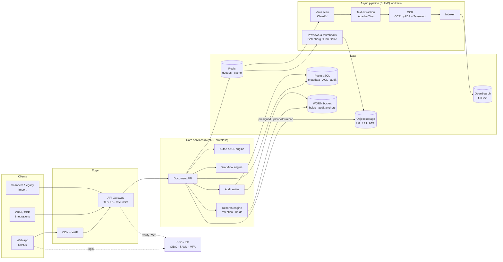
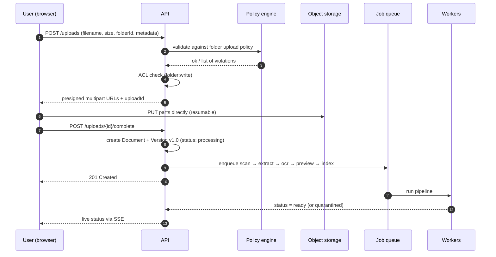

# 03 — System Architecture

## High-level view

## Why this shape

- **Modular monolith first.** One NestJS codebase with strict module boundaries (documents, metadata, search, workflow, records, audit, admin). Deploys as one API service plus workers. This is faster to build and operate than microservices, and any module can be split out later without rewrites.
- **Files never pass through the app server.** Clients upload/download directly to object storage with short-lived presigned URLs. The API only issues the URL after the ACL check and logs the event. This keeps the API fast and memory-flat regardless of file size.
- **Processing is asynchronous.** Uploads return immediately; OCR, extraction, previews and indexing run as queued jobs with retries and dead-letter handling. A 200-page scan doesn't block anyone.
- **PostgreSQL is the source of truth.** OpenSearch is a derived, rebuildable index. If the index is lost it is regenerated from Postgres + object storage.
- **Search is permission-trimmed at the engine.** Each indexed document carries its effective ACL principals; every query adds a filter for the caller's user + group + role IDs. No post-filtering, so no leaking of counts or snippets.

## Upload sequence

## Deployment

| Environment | Purpose |
|---|---|
| `dev` | Per-developer, Docker Compose (Postgres, MinIO, OpenSearch, Redis, Keycloak) |
| `staging` | Mirrors prod at smaller scale; client UAT happens here |
| `prod` | Multi-AZ, auto-scaling app + workers, managed data services |

**Default hosting:** AWS (ECS Fargate or EKS, RDS PostgreSQL, S3, OpenSearch Service, ElastiCache, KMS). Azure equivalents (AKS, Azure Database for PostgreSQL, Blob Storage, Azure AI Search/OpenSearch) are a like-for-like swap if you're a Microsoft shop. On-premise deployment is possible on Kubernetes with MinIO — confirm in discovery.

Infrastructure is defined in **Terraform**; CI/CD via **GitHub Actions** with automated tests, security scans and blue/green deploys.
