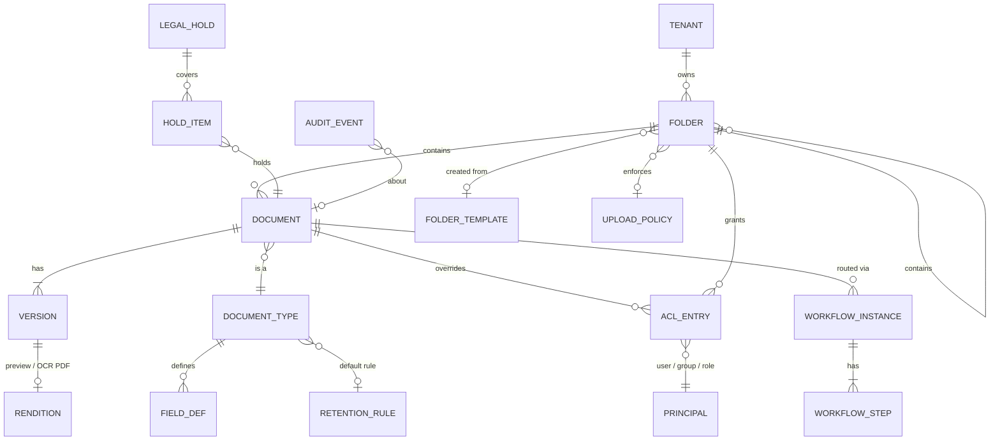

# 05 — Core Data Model

## Key tables

### `document`
| column | type | notes |
|---|---|---|
| id | uuid | |
| tenant_id | uuid | every table is tenant-scoped; RLS policy on tenant_id |
| folder_id | uuid | |
| document_type_id | uuid | |
| title | text | |
| current_version_id | uuid | |
| metadata | jsonb | validated against document type's field definitions |
| status | enum | draft, processing, active, in_review, approved, archived, disposed |
| retention_until | date | computed by records engine |
| hold_count | int | > 0 blocks deletion and disposal |
| created_by / created_at / updated_at | | |

### `version`
| column | type | notes |
|---|---|---|
| id | uuid | |
| document_id | uuid | |
| major / minor | int | 1.0, 1.1, 2.0 … |
| object_key | text | S3 key — content addressed, never overwritten |
| sha256 | char(64) | integrity + duplicate detection |
| size_bytes, mime_type | | |
| extracted_text_status | enum | pending, done, failed |
| change_note | text | |
| created_by / created_at | | versions are **immutable** — no UPDATE grants on content columns |

### `field_def` (configurable metadata engine)
`id, document_type_id, key, label, type (text|number|date|select|multiselect|user|refnum|bool), required, options jsonb, validation_regex, default_expr, searchable, facet, sort_order`

Metadata values are stored in `document.metadata` (JSONB) and validated by a JSON Schema generated from `field_def`. Fields marked `facet` are mapped into the OpenSearch index as keyword/date/number fields for filtering.

### `acl_entry`
`id, resource_type (folder|document), resource_id, principal_type (user|group|role), principal_id, permissions bitmask, effect (allow|deny), inherited bool`

Permissions: `read, download, write, delete, version, share, approve, manage_permissions, manage_retention`.
Effective permission = role baseline ∩ (folder ACL chain with inheritance) with explicit **deny winning**. Computed effective principals are cached per folder and denormalised into the search index.

### `audit_event`
`id bigserial, tenant_id, occurred_at timestamptz, actor_id, actor_ip, user_agent, action, resource_type, resource_id, version_id, details jsonb, prev_hash char(64), hash char(64)`

`hash = SHA-256(prev_hash || canonical_json(event))`. The table is INSERT-only (no UPDATE/DELETE privileges for the app role). See [06-security](06-security.md#audit-integrity).

### Workflow, retention, hold
- `workflow_template(id, name, steps jsonb)`
- `workflow_instance(id, document_id, version_id, template_id, status, started_by, started_at, completed_at)`
- `workflow_step(id, instance_id, order, assignee_type, assignee_id, status, decided_by, decided_at, comment, due_at)`
- `retention_rule(id, name, scope jsonb, trigger (created|modified|event_field), period interval, action (review|archive|dispose))`
- `legal_hold(id, name, matter_ref, reason, created_by, released_at)` / `hold_item(hold_id, document_id)`
- `disposition_batch(id, status, approved_by, executed_at, certificate_object_key)`
