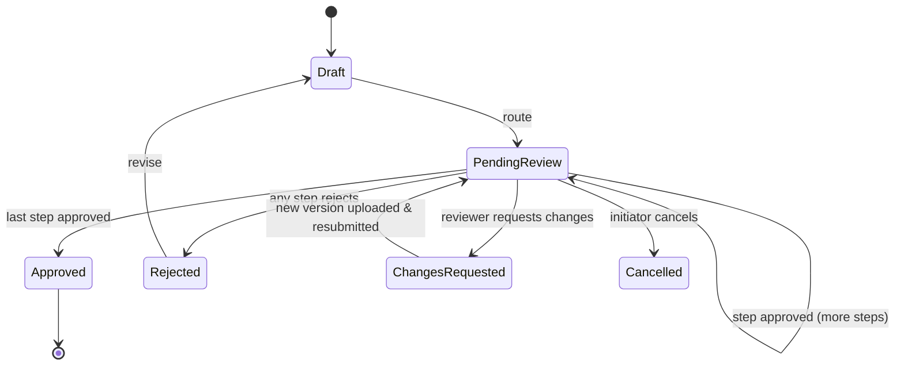

# 08 — Approval Workflows

Intentionally **simple and content-centric**, as your brief asks: linear sequences that anyone can set up, not a BPMN engine that needs a consultant.

## Templates

An admin builds a template as an ordered list of steps:

| Step | Assignee | Rule | SLA |
|---|---|---|---|
| 1 | Role: Department Manager (of the document's department) | any one | 2 days |
| 2 | User: Finance Controller | — | 3 days |
| 3 | Group: Legal | any one | 3 days |

Templates can be bound to a document type or folder so they start automatically on upload (e.g. every *Contract* in `/Legal/Contracts` routes to Legal).

Ad-hoc routing: any user with `approve` delegation can pick reviewers on the fly.

## State machine

## Rules

- Approval is bound to a **specific version**. Uploading a new version after approval shows "v2.1 not approved — v2.0 approved on 3 Oct".
- Reject and Request changes require a comment.
- Delegation: a user can set an out-of-office delegate for a date range.
- Every decision is an audit event with version hash — usable as evidence.

## Notifications

| Event | In-app | Email | Reminder / escalation |
|---|---|---|---|
| Task assigned | ✓ | ✓ | Reminder at 50% SLA |
| Task overdue | ✓ | ✓ | Escalate to assignee's manager / template owner |
| Approved / rejected | ✓ (initiator) | ✓ | — |
| Changes requested | ✓ | ✓ | — |

Daily digest option to reduce email noise. Teams/Slack via webhooks in Phase 2.
