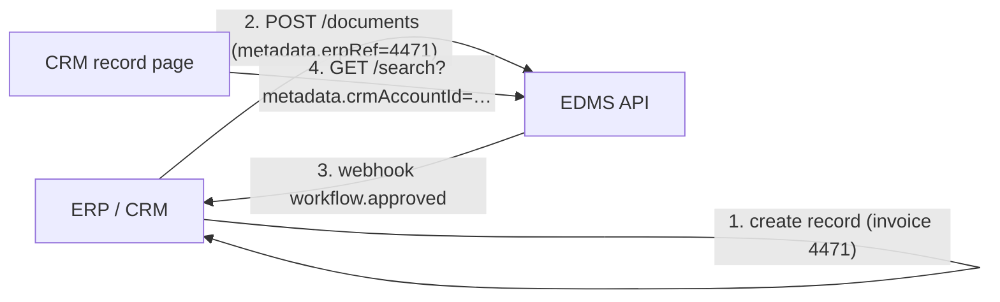

# 09 — Integrations & API

## Principles

- **API-first:** the web app uses the same public API that integrations use. If the UI can do it, an integration can do it.
- **OpenAPI 3.1** spec is the contract ([`/api/openapi.yaml`](../api/openapi.yaml)); Swagger UI and Redoc hosted at `/docs`.
- **Versioned** (`/v1`), backwards-compatible within a major version, deprecations announced with `Sunset` headers.
- **Same permission model:** integration clients act as a service principal with scoped permissions — or on behalf of a user via OAuth.

## Authentication for integrations

| Method | Use |
|---|---|
| OAuth2 client credentials | Server-to-server (ERP pushing invoices) |
| OAuth2 authorization code + PKCE | Apps acting as a user (CRM side panel) |
| Scoped API keys | Simple scripts, migration jobs; scopes like `documents:read`, `documents:write`, `search`, `workflows` |

## Main resource groups

`/folders` · `/documents` · `/documents/{id}/versions` · `/documents/{id}/metadata` · `/uploads` · `/search` · `/workflows` · `/tasks` · `/retention-rules` · `/legal-holds` · `/audit-events` · `/webhooks` · `/admin/*`

## Webhooks

Signed (HMAC-SHA256) POST events with retries & exponential backoff, delivery log in the admin UI.

`document.created` · `document.updated` · `version.created` · `document.deleted` · `workflow.started` · `workflow.step_completed` · `workflow.approved` · `workflow.rejected` · `hold.placed` · `hold.released` · `disposition.executed`

## CRM / ERP integration pattern

Typical connectors:
- **Attach & link:** documents stored in the EDMS, linked by external reference fields (`erpRef`, `crmAccountId`), so the CRM/ERP shows a "Documents" panel instead of storing files itself.
- **Event-driven sync:** status changes flow back via webhooks (e.g. invoice approved → ERP posts it).
- **Embedded view:** a small iframe/widget for CRM record pages, authenticated via SSO.

One connector to a system of your choice is included in the MVP; specific systems (Salesforce, Dynamics 365, SAP, Odoo, NetSuite, HubSpot…) are confirmed in discovery.
