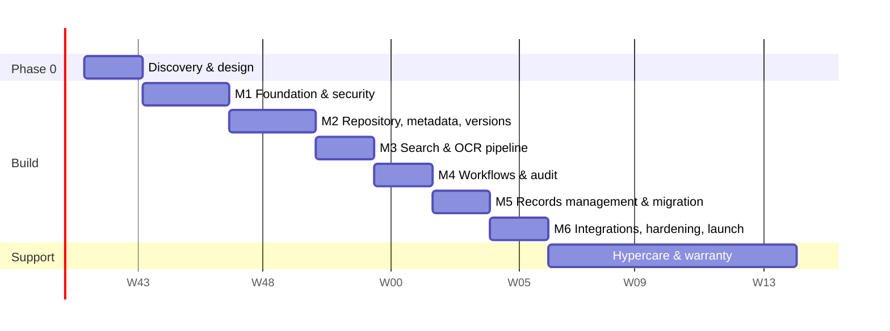

# 11 — Timeline, Milestones & Pricing

**Model:** fixed price per milestone. Each milestone ends with a demo on staging and a 5-working-day UAT window; payment is released only when you accept it. You own all code and IP from the first commit.

## Timeline (~16 weeks to production)

*Start date shown is illustrative.*

## Milestones

| # | Milestone | Weeks | Deliverables | Price (USD) |
|---|---|---|---|---|
| 0 | **Discovery & Design** | 1–2 | Stakeholder workshops, requirements sign-off, hi-fi Figma designs for all screens, metadata & folder taxonomy, retention schedule draft, final architecture, infra sizing & cost, legacy source analysis, fixed backlog | **$2,400** |
| 1 | **Foundation & Security** | 3–5 | Infra as code (staging + prod), CI/CD, SSO + MFA, users/groups/roles, RBAC + ACL engine, tenant isolation, audit writer with hash chain, admin shell | **$4,500** |
| 2 | **Repository, Metadata & Versions** | 6–8 | Folder templates, folder tree & grid, single/bulk/resumable upload, upload policies, configurable metadata & document types, viewer, version history/restore/compare, check-in/out | **$5,500** |
| 3 | **Search & OCR** | 9–10 | Extraction + OCR + preview pipeline, virus scanning, OpenSearch index, permission-trimmed full-text search, facets, highlighting, saved searches | **$4,000** |
| 4 | **Workflows & Audit** | 11–12 | Workflow templates, ad-hoc routing, task inbox, statuses, email/in-app notifications, SLA reminders/escalation, audit log UI & export, chain verification | **$4,000** |
| 5 | **Records Management & Migration** | 13–14 | Retention rules engine, legal holds (+ Object Lock), disposition queue & destruction certificates, archival tiering, migration toolkit + migration of 1 legacy source | **$4,200** |
| 6 | **Integrations, Hardening & Launch** | 15–16 | Public API + docs + SDKs, webhooks, 1 CRM/ERP connector, load testing, security fixes from pen test, full documentation set, production launch, admin/user training | **$4,400** |
| | | | **Total** | **$29,000** |

### Included at no extra cost
- 60 days post-launch warranty (bug fixes on delivered scope)
- 2 weeks hypercare (priority response) after go-live
- 2 live training sessions (admins, end users) + recorded tutorials

### Not included in the fixed price (billed at cost / by you directly)
- Cloud hosting & third-party services (estimate in [04-tech-stack](04-tech-stack.md#hosting-cost-estimate-indicative-aws-staging--prod))
- Independent penetration test vendor fee (typically $3,000–6,000; I'll source quotes, or use your vendor)
- Paid OCR APIs if chosen over the self-hosted default

### Optional
| Item | Price |
|---|---|
| Additional CRM/ERP connector | from $1,800 each |
| Additional legacy migration source | from $1,500 each (depends on source) |
| Phase 2 features (scanner capture, auto-metadata extraction, e-signature, Office add-in, watermarking, Teams/Slack) | quoted after discovery |
| Ongoing maintenance & support retainer | from $800 / month |

## Payment
- 0% upfront beyond Milestone 0 funding in escrow.
- Each milestone funded in Upwork escrow before it starts; released on your acceptance.
- If you decide after Discovery not to proceed, you keep the full design package and architecture.

## Team & communication
- You work directly with me (architect + lead developer), backed by my team for frontend, QA and DevOps.
- Weekly demo call + written progress report every Friday; shared board with every ticket visible.
- Response within 4 working hours (PKT, with overlap for US/UK/EU business hours).
